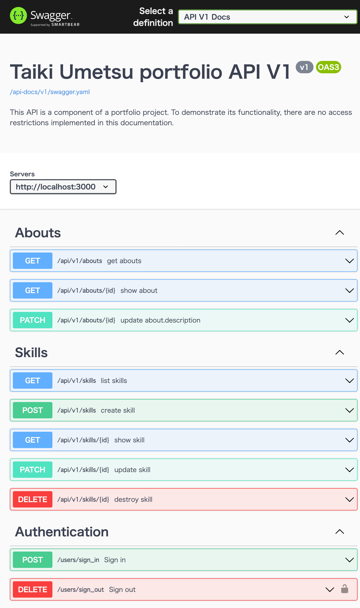

# Versions

- Ruby: 3.2.1
- Ruby on Rails: 7.0.4.3

# Formatter

- rubocop
- VSCode settings.json is like this:

  ```json
    "[ruby]": {
      "editor.defaultFormatter": "misogi.ruby-rubocop",
      "editor.formatOnSave": true
    }
  ```

# Swagger

- Gem: rswag
- this application's API document: <br>
  https://portfolio-api.taikiumetsu.dev/api-docs/index.html
  

# CI/CD

- GitHub Actions
- setting file: `.github/workflows/fly.yml`
- trigger branch: main
- run tests
- run deployment
- run `rails db:seed`

# Infrastructure

- [Fly.io](https://fly.io/dashboard/)

# DB

- PostgreSQL

# Domain

- [Google Domains](https://domains.google.com/registrar/)

# Authentication

- Gem:
  - devise
  - devise-jwt

# User Access Level

- Gem: cancancan
- To manage permissions and restrict access to the APIs, users have one of the following access levels:
  - _Read-only_
  - _Full access_

# This API is used in the following locations:

### Portfolio page

- https://portfolio.taikiumetsu.dev/
- https://github.com/taiki-umetsu/portfolio-ui

### Admin page

- https://portfolio-admin.taikiumetsu.dev/
- https://github.com/taiki-umetsu/portfolio-admin
